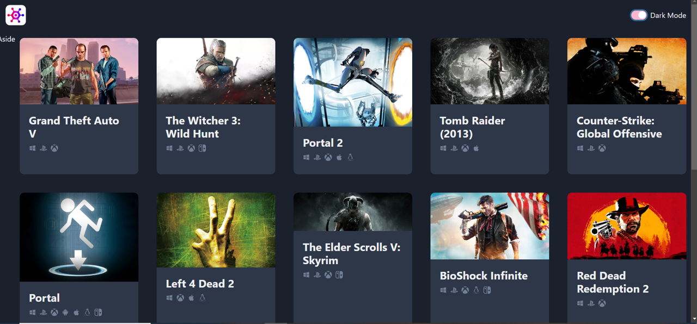

# clone-game-website

## Features

- Browse and filter games by genre and platform.
- Sort games based on different criteria.
- Search for specific games using keywords.
- [Live Demo](https://kudoo39.github.io/clone-game-website/)

## Technologies Used

- TypeScript
- React
- Chakra UI

## Installation and Usage

1. Clone this repository: `git clone https://github.com/Kudoo39/clone-game-website/`
2. Navigate to the project directory: `cd clone-game-website`
3. Install dependencies: `npm install`

**NOTE:** Before proceeding, you'll need to obtain an API key from [rawg.io](https://rawg.io) to access the game data. Follow the instructions below to set up your API key:

   - Go to [rawg.io](https://rawg.io/apidocs) and sign up for an account.
   - Once you have an account, generate an API key from your account settings.
   - Create a `.env` file in the root directory of your project if it doesn't already exist.
   - In the `.env` file, add your API key like this: `VITE_API_KEY=your_api_key_here`
   - Replace `your_api_key_here` with the actual API key you obtained.
   - Save the `.env` file.

   By setting the API key in the `.env` file, your project will be able to access the API without exposing sensitive information publicly.
   
4. Start the development server: `npm run dev`

## API Usage and Rate Limit

This app uses an external API from rawg.io to fetch game data. Please be mindful of the API rate limit to ensure uninterrupted access to game data.

